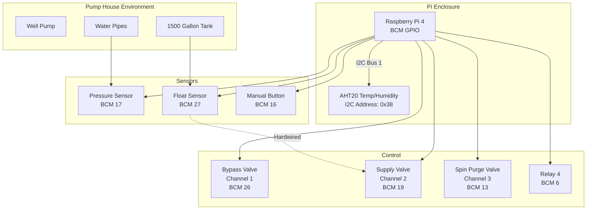
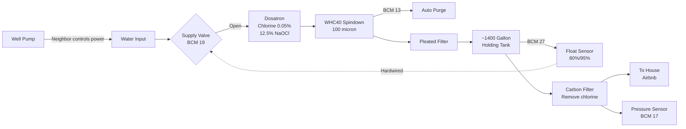
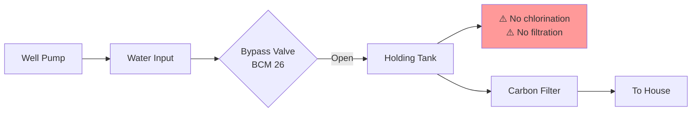
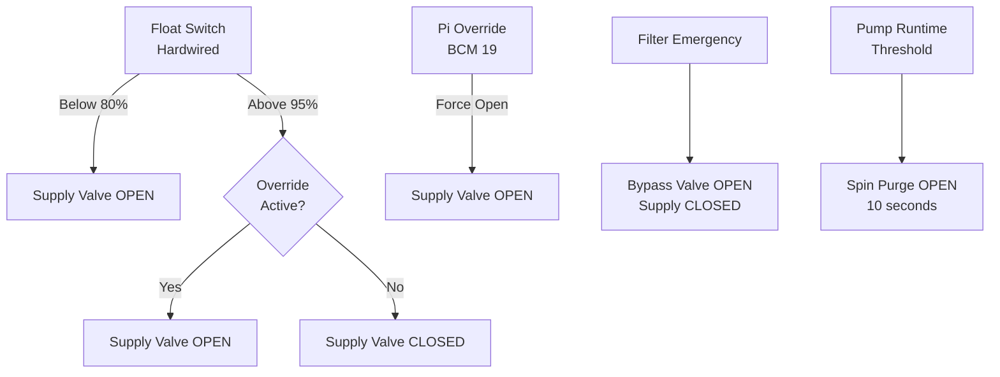
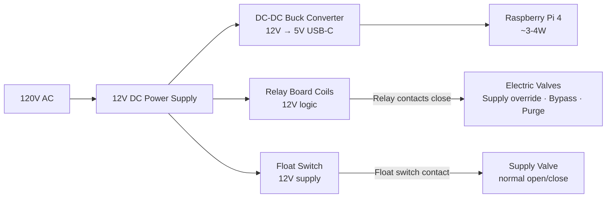
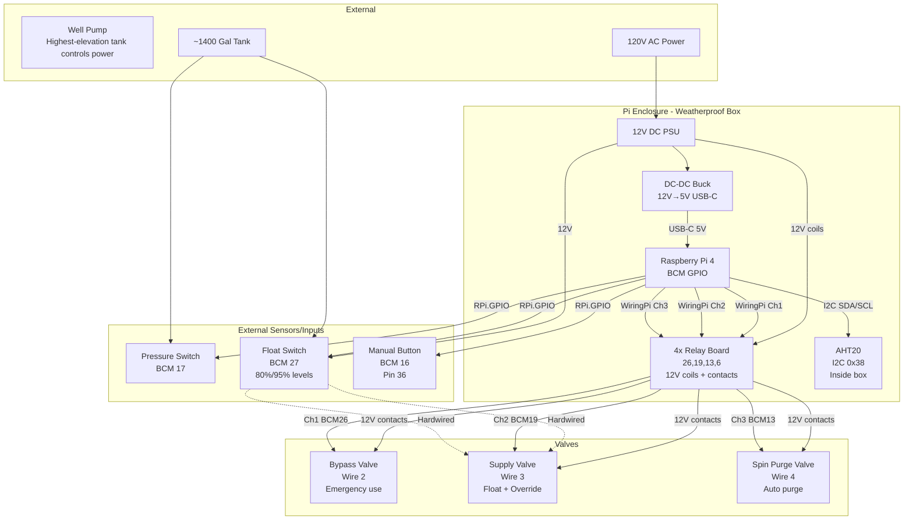

# Hardware Reference

Complete hardware reference for the Pumphouse Monitor system, including all sensors, data sources, GPIO assignments, valve configuration, and water system flow.

---

## Sensors & Data Sources

### On-Site Sensors (Pi-connected)

| Sensor | Interface | GPIO / Address | Notes |
|--------|-----------|---------------|-------|
| Pressure switch | GPIO input | BCM 17 (physical pin 11) | 10 PSI NC switch; opens when pressure ≥ 10 PSI (pump running). Ground on pin 9. |
| Float switch | GPIO input | BCM 27 (physical pin 13) | NO switch; hardwired to supply valve relay AND monitored by Pi. HIGH = tank full (≥95%), LOW = calling (<80%). Ground to GND. |
| Temp / humidity | I2C | Bus 1, address 0x38 | AHT20 inside Pi enclosure. Monitors enclosure health (freeze risk, condensation). |
| Manual button | GPIO input | BCM 16 (physical pin 36) | Active LOW with pull-up. Function TBD. |

### On-Site Network Devices

| Device | Address / Protocol | Purpose |
|--------|--------------------|---------|
| Amcrest IP camera | `192.168.1.81`, RTSP + HTTPS | Live sunset/RTSP frames for timelapse capture; snapshot via HTTP Digest auth |
| Ecobee thermostats (2×) | `ecobee.com`, Selenium | Living Room + Hallway; temperature display and preset control via web scraping |
| Ambient Weather station | [integration TBD] | On-site weather; would provide local temperature, wind, humidity, rainfall |

### Off-Site / Remote Data Sources

| Source | Method | Data |
|--------|--------|------|
| Tank depth sensor (mypt.in) | HTTP scrape, every 60 s | Tank depth (inches), percentage full, gallons; includes `last_updated` timestamp for staleness tracking |
| TrackHS | Web scrape (`scrape_reservations.py`), 2×/day | Guest reservations: check-in/out, guest name, type, income, status |
| NWS KONP | NWS API, cached per day | Newport Municipal Airport observations: temperature hi/lo, wind, precipitation, humidity, conditions |
| Open-Meteo ERA5 | ERA5 API, cached per day | Historical cloud cover and solar radiation; fallback when NWS data unavailable |

---

## System Overview



---

## GPIO Pin Assignments

| BCM Pin | Physical Pin | Function | Type | Library |
|---------|--------------|----------|------|---------|
| 2 | 3 | I2C SDA | I2C Data | Python (board) |
| 3 | 5 | I2C SCL | I2C Clock | Python (board) |
| 6 | 31 | Relay 4 (Reserved) | Output | WiringPi (gpio) |
| 13 | 33 | Spin Purge Valve (Channel 3) | Output | WiringPi (gpio) |
| 16 | 36 | Manual Button | Input | Python (RPi.GPIO) |
| 17 | 11 | Pressure Sensor | Input | Python (RPi.GPIO) |
| 19 | 35 | Supply Valve (Channel 2) | Output | WiringPi (gpio) |
| 26 | 37 | Bypass Valve (Channel 1) | Output | WiringPi (gpio) |
| 27 | 13 | Float Sensor | Input | Python (RPi.GPIO) |

### Reserved / Unavailable Pins

| BCM Pin(s) | Function | Reason to Avoid |
|------------|----------|-----------------|
| 0, 1 | ID EEPROM | HAT identification |
| 4 | GPCLK0 | Clock signal |
| 7, 8, 9, 10, 11 | SPI | SPI interface |
| 14, 15 | UART/Serial | Console/debugging |

---

## Valve Configuration & Functions

### Relay Channel Assignments

| Channel | BCM Pin | Physical Pin | Valve Name | Power Wire | Function |
|---------|---------|--------------|------------|------------|----------|
| 1 | 26 | 37 | Bypass Valve | Wire 2 | Emergency bypass — water flows to tank without filtration/dosing |
| 2 | 19 | 35 | Supply Valve | Wire 3 | Primary inlet — allows water to flow into tank (with float override) |
| 3 | 13 | 33 | Spin Purge Valve | Wire 4 | Automated spindown filter purging to remove sediment |
| 4 | 6 | 31 | Reserved | — | Available for future use |

### Supply Valve (Channel 2 — BCM 19)

Primary water flow from well into the holding tank.

**Hardware configuration:**
- Float switch is **hardwired** directly to the supply valve (completely independent of Pi)
- Pi relay (BCM 19) provides **override** capability only

**Float switch behavior (hardwired):**
- Turns ON: tank drops below ~80% (±5%)
- Turns OFF: tank reaches ~95% (±5%)
- ~15% hysteresis prevents rapid cycling; cannot be disabled by Pi

**Pi override function:**
- Forces valve open above the 80% level (fill opportunistically when well power available)
- Does not disable float switch protection
- When override active: valve stays open until override is turned off AND float switch indicates >95%

**Normal water path (supply valve open):**
```
Well → Dosatron (chlorine injection) → Spindown filter → Pleated filter → Tank
```

### Bypass Valve (Channel 1 — BCM 26)

Emergency water delivery bypassing filtration and chemical injection.

**Use cases:**
- Filter clogged / Dosatron failure
- Emergency water delivery while maintenance is arranged

**Bypass water path:**
```
Well → DIRECTLY to Tank (no chlorination, no filtration)
```

⚠️ **Never run both supply and bypass simultaneously.** Water quality may be degraded; guests should be notified; consider chlorine shock treatment after use.

### Spin Purge Valve (Channel 3 — BCM 13)

Automated backflush of the WHC40 spindown filter.

- Opens to flush collected sediment after configured pump runtime
- Extends filter service interval from weekly (~$2,860/yr) to 6–8 months (~$330–440/yr)
- Annual savings: ~$2,400

### Valve Operation Matrix

| Scenario | Supply Valve | Bypass Valve | Spin Purge | Result |
|----------|--------------|--------------|------------|--------|
| Normal Operation | AUTO (Float) | CLOSED | AUTO | Standard filtered/chlorinated water |
| Manual Fill | OVERRIDE ON | CLOSED | AUTO | Force fill above 80% when well power available |
| Filter Emergency | CLOSED | OPEN | N/A | Unfiltered water to tank (temporary) |
| Filter Maintenance | CLOSED | CLOSED | CLOSED | No water flow during service |
| Purge Cycle | OPEN | CLOSED | OPEN (10 s) | Flush sediment while filling |

---

## Water System Flow

### Normal Operation



### Emergency Bypass



### Supply Valve Logic



---

## Wiring Reference

### Pressure Sensor (Switch)

```
Pressure Switch    Raspberry Pi
---------------    ------------
NC contact   <-->  BCM 17 (Pin 11)
C (Common)   <-->  Ground (Pin 9)

Function: NC contact opens when pressure ≥ 10 PSI (pump running)
```

### Float Sensor (Switch)

```
Float Switch       Raspberry Pi
------------       ------------
NO contact   <-->  BCM 27 (Pin 13)
Common       <-->  Ground

Float Switch       Supply Valve
------------       ------------
NO contact   <-->  Hardwired connection (independent of Pi)

Function:
  Pi connection:  Monitor tank level (80%/95% thresholds)
  Hardwired:      Direct control of supply valve with hysteresis
```

### I2C Temperature/Humidity Sensor (AHT20)

```
AHT20        Raspberry Pi
------       ------------
VCC    <-->  3.3V (Pin 1 or 17)
GND    <-->  Ground (Pin 6, 9, 14, 20, 25, 30, 34, or 39)
SDA    <-->  BCM 2 (Pin 3)
SCL    <-->  BCM 3 (Pin 5)
```

### Relay Board

```
Relay Board     Raspberry Pi     Function            Power Wire
-----------     ------------     --------            ----------
VCC       <-->  12V              Power for relay coils and valve actuators
GND       <-->  Ground
IN1       <-->  BCM 26 (Pin 37)  Bypass Valve        Wire 2
IN2       <-->  BCM 19 (Pin 35)  Supply Valve        Wire 3
IN3       <-->  BCM 13 (Pin 33)  Spin Purge Valve    Wire 4
IN4       <-->  BCM 6  (Pin 31)  Reserved/Unused
```

### Manual Button

```
Button         Raspberry Pi
------         ------------
NO/COM   <-->  BCM 16 (Pin 36)
GND      <-->  Ground

Configuration: Active LOW (pressed = 0, released = 1) with pull-up resistor
```

---

## Hardware Setup

### Enclosure

The Pi lives in a weatherproof enclosure with cable glands for:
- Power in (12V)
- Sensor wires (pressure, float, button)
- Relay outputs (wires 2, 3, 4)

### Power System



One 12V supply powers everything: the Pi (via DC-DC buck converter to 5V USB-C), the relay board coils, the float switch circuit, and — through the relay contacts — the electric valve actuators. The float switch is wired in series with the supply valve's 12V feed so it directly controls valve power. The Pi's override relay (BCM 19) is wired in parallel with the float switch contact, allowing the Pi to hold the valve open regardless of float state.

### GPIO Library Usage

| Component | Library | Why |
|-----------|---------|-----|
| Relays (all) | WiringPi (`gpio` command) | Avoids multi-process Python GPIO conflicts |
| Pressure sensor | RPi.GPIO | Direct GPIO input reading |
| Float sensor | RPi.GPIO | Direct GPIO input reading |
| Manual button | RPi.GPIO | Direct GPIO input reading |
| Temp/humidity | adafruit-circuitpython-ahtx0 | I2C protocol handling |

**Key rule:** WiringPi and Python RPi.GPIO can coexist as long as they use different pins. Python locks pins exclusively — two Python scripts on the same pin will conflict.

---

## Equipment Specifications

### Dosatron Chemical Injection

- **Model**: D14WL3000NAFII (NSF Certified)
- **Injection range**: 0.03% to 0.3% (1:3000 to 1:333)
- **Flow range**: 0.05 to 14 GPM
- **Chemical**: 12.5% sodium hypochlorite (pool chlorine)
- **Setting**: 0.05% (~6 ppm injection)
- **Location**: Between well and holding tank, before supply valve
- **Bypassed by**: Emergency bypass valve (BCM 26)

### Filtration System

- **Primary**: WHC40 spindown filter, 100-micron — auto-purge via BCM 13
- **Secondary**: Pleated filtration
- **Tertiary**: Carbon filter — removes chlorine before household use

### Holding Tank

- **Capacity**: ~1,400–1,500 gallons
- **Fill control**: Float switch (hardwired) with 80%/95% hysteresis
- **Fill rate**: ~2–3 gallons per 15–20 minutes (well production rate)
- **Override**: Pi relay (BCM 19) for opportunistic filling above 80%

### Valves

| Valve | Control | Purpose |
|-------|---------|---------|
| Supply Valve | BCM 19 (override) + Float (hardwired) | Normal water inlet with chlorination and filtration |
| Bypass Valve | BCM 26 | Emergency unfiltered water delivery |
| Spin Purge Valve | BCM 13 | Automated spindown filter backflush |

---

## Environmental Considerations (Coastal Oregon)

### Temperature / Humidity in Pi Enclosure

The AHT20 sensor monitors the Pi enclosure environment:

| Condition | Range | Action |
|-----------|-------|--------|
| Temperature | 40–85°F | Normal |
| Temperature | <40°F | Freeze risk; check heating |
| Temperature | >85°F | Pi throttling risk; check cooling |
| Humidity | 30–75% | Normal |
| Humidity | >85% | Condensation risk; add desiccant |
| Humidity | >90% | High risk; check seals |

Initial measurement after opening box in rain: 89.7% RH @ 54.2°F → naturally decreased to ~81% within 1 hour.

### Salt Air Corrosion

Expected component lifespan: 2–5 years. Mitigation:
- Conformal coating on PCBs
- Silicone grease on terminals
- Regular inspection schedule

### Freeze Protection

Monitor for enclosure temperature <40°F and humidity spikes (ice formation/melting).

---

## System Diagram (Complete)



---

## Project Context

### Site Constraints

- **Distance**: 10-hour round trip from primary residence; infrequent visits (monthly at best)
- **Well power**: Controlled by the highest-elevation tank in the system — not always available; creates timing dependency for tank filling
- **Well production**: ~2–3 gallons every 15–20 minutes (not continuous high-volume flow)
- **Guests**: Airbnb guests depend on continuous water availability

### Design Philosophy

**"Remember in 5 Years" Principle**: All components maintainable without specialized knowledge. Clear documentation, standard connectors, minimal custom fabrication.

### Success Criteria

- ✅ Reduced maintenance visits (from weekly to 6–8 months)
- ✅ Remote monitoring and control
- ✅ Prevent freeze damage
- ✅ Ensure guest water availability
- ✅ Automated spindown filter purging
- ✅ Emergency bypass capability

---

*Last hardware update: November 2024 — Raspberry Pi 4, Raspberry Pi OS Trixie (Debian 13), Python 3.13, coastal Oregon*

---

## Appendix: Useful `gpio` Commands (WiringPi)

The `gpio` CLI uses BCM pin numbering when the `-g` flag is present. All relay control in this project uses `gpio -g write` to avoid multi-process conflicts with Python's RPi.GPIO.

### Pin Overview

```bash
gpio readall        # Full table: WiringPi, BCM, physical pin numbers, mode, and current value
gpio -v             # WiringPi version and Pi hardware info
```

`gpio readall` is the fastest way to see the state of every pin at a glance. The output columns are:
`BCM | wPi | Name | Mode | V | Physical | V | Mode | Name | wPi | BCM`

### Reading Pins

```bash
gpio -g read 17     # Pressure sensor  (1=LOW/pump off, 0=HIGH/pump running — NC switch)
gpio -g read 27     # Float switch     (1=FULL/open, 0=CALLING/closed)
gpio -g read 16     # Manual button    (1=released, 0=pressed — active LOW)
```

### Setting Pin Mode

```bash
gpio -g mode 17 in          # Set BCM 17 as input
gpio -g mode 26 out         # Set BCM 26 as output
gpio -g mode 17 up          # Enable pull-up resistor
gpio -g mode 17 down        # Enable pull-down resistor
gpio -g mode 17 tri         # Disable pull resistor (floating)
```

### Relay Control (Active-Low Board)

The relay board is **active-low**: writing `0` energizes the coil (valve ON), writing `1` de-energizes it (valve OFF).

```bash
# Bypass valve (Channel 1 — BCM 26)
gpio -g write 26 0      # Bypass ON  (valve opens)
gpio -g write 26 1      # Bypass OFF (valve closes)

# Supply override valve (Channel 2 — BCM 19)
gpio -g write 19 0      # Override ON  (holds supply valve open)
gpio -g write 19 1      # Override OFF (float switch resumes control)

# Spin purge valve (Channel 3 — BCM 13)
gpio -g write 13 0      # Purge ON  (opens drain on spindown filter)
gpio -g write 13 1      # Purge OFF (closes drain)

# Channel 4 / reserved (BCM 6)
gpio -g write 6 0       # ON
gpio -g write 6 1       # OFF
```

> **Prefer `control.sh`** for interactive use — it wraps these commands with safety checks and logging. Use raw `gpio` commands only for quick diagnostics.

### I2C Diagnostics

```bash
sudo i2cdetect -y 1     # Scan I2C bus 1 — AHT20 should appear at 0x38
i2cget -y 1 0x38 0x00   # Read a register from AHT20 (raw)
```

### Quick Status Check

```bash
# One-liner: show relay and sensor states
gpio -g read 26; gpio -g read 19; gpio -g read 13   # relays (0=ON, 1=OFF)
gpio -g read 17; gpio -g read 27                     # pressure, float
```
