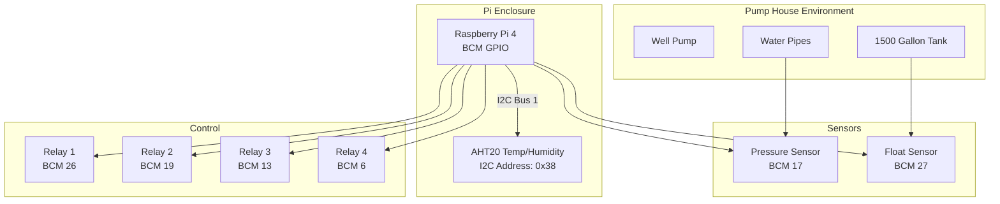
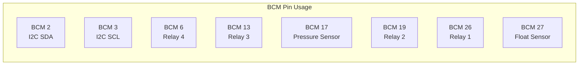
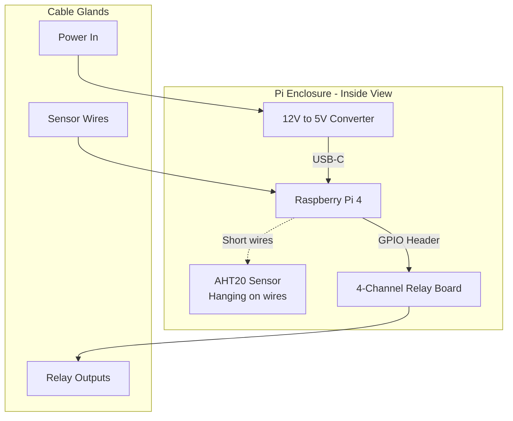
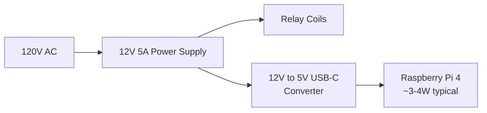
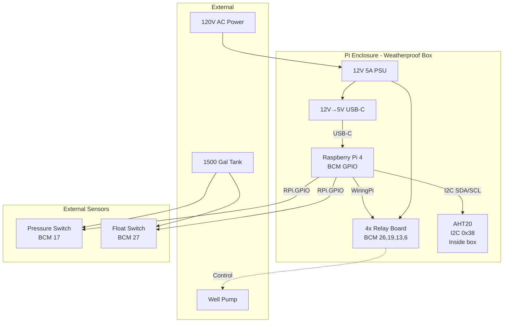

# Pump House Monitoring System

Raspberry Pi 4 based monitoring and control system for remote well water pump house.

## System Overview


## GPIO Pin Assignments


### Pin Table

| BCM Pin | Physical Pin | Function | Type | Library |
|---------|--------------|----------|------|---------|
| 2 | 3 | I2C SDA | I2C Data | Python (board) |
| 3 | 5 | I2C SCL | I2C Clock | Python (board) |
| 6 | 31 | Relay 4 | Output | WiringPi (gpio) |
| 13 | 33 | Relay 3 | Output | WiringPi (gpio) |
| 17 | 11 | Pressure Sensor | Input | Python (RPi.GPIO) |
| 19 | 35 | Relay 2 | Output | WiringPi (gpio) |
| 26 | 37 | Relay 1 | Output | WiringPi (gpio) |
| 27 | 13 | Float Sensor | Input | Python (RPi.GPIO) |

### Reserved/Unavailable Pins

| BCM Pin(s) | Function | Reason to Avoid |
|------------|----------|-----------------|
| 0, 1 | ID EEPROM | HAT identification |
| 4 | GPCLK0 | Clock signal |
| 7, 8, 9, 10, 11 | SPI | SPI interface |
| 14, 15 | UART/Serial | Console/debugging |

## Hardware Setup

### Enclosure Layout


### Power System


**Why separate power supplies:**
- Relay switching doesn't affect Pi power
- Easier troubleshooting
- Pi gets clean 5V power

## Software Architecture

### Library Usage by Component

| Component | Library | Why This Choice |
|-----------|---------|-----------------|
| Relays | WiringPi (`gpio` command) | Simple, command-line testable |
| Pressure Sensor | RPi.GPIO | Direct GPIO input reading |
| Float Sensor | RPi.GPIO | Direct GPIO input reading |
| Temp/Humidity | adafruit-circuitpython-ahtx0 | I2C protocol handling |
| CPU Temperature | `/sys/class/thermal/thermal_zone0/temp` | Built-in kernel interface |

### GPIO Library Interactions


**Key Points:**
- **WiringPi and Python can coexist** if using different pins
- **Python locks pins exclusively** - can't run two scripts on same pin
- **`gpio readall` is safe** - read-only, doesn't claim pins
- **`GPIO.cleanup()`** releases pins when script exits

## Installation & Setup

### Enable I2C
```bash
sudo raspi-config
# Interface Options -> I2C -> Enable
sudo reboot
```

### Install Required Software
```bash
# System packages
sudo apt update
sudo apt install -y python3-pip i2c-tools wiringpi

# Python libraries
sudo pip3 install RPi.GPIO adafruit-circuitpython-ahtx0 --break-system-packages
```

### Verify I2C Sensor
```bash
# Should show device at 0x38
sudo i2cdetect -y 1
```

### Test Temperature Sensor
```python
#!/usr/bin/env python3
import board
import adafruit_ahtx0

i2c = board.I2C()
sensor = adafruit_ahtx0.AHTx0(i2c)

temp_f = (sensor.temperature * 9/5) + 32
print(f"Temp: {temp_f:.1f}°F  Humidity: {sensor.relative_humidity:.1f}%")
```

### Test Relay Control
```bash
# WiringPi commands
gpio -g mode 26 out    # Set BCM 26 as output
gpio -g write 26 1     # Turn relay ON
gpio -g write 26 0     # Turn relay OFF
gpio readall           # Show all pin states
```

## Environmental Monitoring

### Temperature & Humidity Sensor (AHT20)

**Location:** Inside Pi enclosure  
**Purpose:** Monitor enclosure health, detect condensation risk

#### Normal Operating Ranges

| Condition | Range | Action |
|-----------|-------|--------|
| Temperature | 40-85°F | Normal operation |
| Temperature | <40°F | Check heating, freeze risk |
| Temperature | >85°F | Check cooling, Pi throttling risk |
| Humidity | 30-75% | Normal operation |
| Humidity | >85% | Condensation risk - add desiccant |
| Humidity | >90% | High risk - check seals |

#### Dew Point Calculation
```python
import math

def calculate_dew_point(temp_c, humidity):
    """
    Magnus formula approximation
    Returns dew point in Celsius
    """
    a = 17.27
    b = 237.7
    alpha = ((a * temp_c) / (b + temp_c)) + math.log(humidity/100.0)
    dew_point = (b * alpha) / (a - alpha)
    return dew_point
```

**Condensation occurs when any surface drops below dew point temperature.**

### CPU Temperature Monitoring
```python
def get_cpu_temp():
    with open('/sys/class/thermal/thermal_zone0/temp', 'r') as f:
        temp = float(f.read()) / 1000.0
    return temp
```

**Thermal Limits:**
- **Normal idle:** 40-50°C
- **Under load:** 50-70°C
- **Throttling starts:** 80°C (CPU slows down)
- **Critical shutdown:** 85°C

**CPU temp ≠ Ambient temp** - CPU runs 10-20°C hotter than enclosure air.

## Maintenance Considerations

### Future Improvements

- [ ] Add barrel connectors for easy Pi box removal
- [ ] Service loops (12-18" slack) in all wiring
- [ ] Silica gel desiccant packs if humidity stays >85%
- [ ] Label all connections with heat shrink
- [ ] Consider conformal coating on boards for moisture protection

### Condensation Mitigation

If humidity remains high (>85% for extended periods):

1. **Passive desiccant** - Rechargeable silica gel packs
2. **Ventilation** - Breathable membrane vent (top) + sealed gland (bottom)
3. **Active heating** - Small heating element (Pi self-heating may be sufficient)

### Cable Gland Best Practices

- Proper IP rating for outdoor environment
- Don't over-tighten (can damage cable insulation)
- Leave stress relief loops inside box
- Use appropriately sized glands for wire bundle

## Troubleshooting

### I2C Sensor Not Detected
```bash
# Check if I2C is enabled
ls /dev/i2c*

# Scan for devices
sudo i2cdetect -y 1

# Check wiring
# VCC -> 3.3V (pin 1 or 17)
# GND -> Ground
# SDA -> BCM 2 (pin 3)
# SCL -> BCM 3 (pin 5)
```

### Python GPIO Conflicts

**Error:** `RuntimeWarning: This channel is already in use`

**Solutions:**
```python
# Option 1: Suppress warnings (not recommended)
GPIO.setwarnings(False)

# Option 2: Clean up before use
GPIO.cleanup()

# Option 3: Always clean up when done
try:
    # Your code
finally:
    GPIO.cleanup()

# Option 4: Consolidate into single script
```

### Relay Not Switching
```bash
# Check if pin is set as output
gpio readall

# Test manually
gpio -g mode 26 out
gpio -g write 26 1

# Check physical connections
# - Power to relay board
# - GPIO connection
# - Relay board jumpers (if applicable)
```

## System Diagram - Complete


## Code Examples

### Read Temperature Sensor (Command Line Tool)

Save as `~/bin/read_temp.py`:
```python
#!/usr/bin/env python3
"""Simple command-line temperature reader for AHT20 sensor"""
import sys
import board
import adafruit_ahtx0

try:
    i2c = board.I2C()
    sensor = adafruit_ahtx0.AHTx0(i2c)
    temp_f = (sensor.temperature * 9/5) + 32
    humidity = sensor.relative_humidity
    
    # Output format: "temp_f humidity"
    print(f"{temp_f:.1f} {humidity:.1f}")
except Exception as e:
    print(f"Error reading sensor: {e}", file=sys.stderr)
    sys.exit(1)
```

Make executable:
```bash
chmod +x ~/bin/read_temp.py
```

### Complete Monitoring Script
```python
#!/usr/bin/env python3
"""
Pump house monitoring system
Reads all sensors and logs to file
"""
import time
import board
import adafruit_ahtx0
import RPi.GPIO as GPIO
from datetime import datetime

# GPIO Pin Configuration (BCM numbering)
PRESSURE_SENSOR_PIN = 17
FLOAT_SENSOR_PIN = 27

# Initialize GPIO
GPIO.setmode(GPIO.BCM)
GPIO.setup(PRESSURE_SENSOR_PIN, GPIO.IN, pull_up_down=GPIO.PUD_UP)
GPIO.setup(FLOAT_SENSOR_PIN, GPIO.IN, pull_up_down=GPIO.PUD_UP)

# Initialize I2C sensor
i2c = board.I2C()
temp_sensor = adafruit_ahtx0.AHTx0(i2c)

def get_cpu_temp():
    """Read CPU temperature"""
    with open('/sys/class/thermal/thermal_zone0/temp', 'r') as f:
        return float(f.read()) / 1000.0

def celsius_to_fahrenheit(celsius):
    """Convert Celsius to Fahrenheit"""
    return (celsius * 9/5) + 32

def read_all_sensors():
    """Read all system sensors"""
    # Temperature/Humidity
    temp_c = temp_sensor.temperature
    temp_f = celsius_to_fahrenheit(temp_c)
    humidity = temp_sensor.relative_humidity
    
    # CPU Temperature
    cpu_temp_c = get_cpu_temp()
    cpu_temp_f = celsius_to_fahrenheit(cpu_temp_c)
    
    # Digital sensors
    pressure = GPIO.input(PRESSURE_SENSOR_PIN)
    float_switch = GPIO.input(FLOAT_SENSOR_PIN)
    
    return {
        'timestamp': datetime.now().isoformat(),
        'temp_f': temp_f,
        'humidity': humidity,
        'cpu_temp_f': cpu_temp_f,
        'pressure': pressure,
        'float': float_switch
    }

def main():
    """Main monitoring loop"""
    print("Pump House Monitor Starting...")
    print("Press Ctrl+C to exit")
    
    try:
        while True:
            data = read_all_sensors()
            
            # Console output
            print(f"{data['timestamp']} | "
                  f"Temp: {data['temp_f']:.1f}°F | "
                  f"Humidity: {data['humidity']:.1f}% | "
                  f"CPU: {data['cpu_temp_f']:.1f}°F | "
                  f"Pressure: {'OK' if data['pressure'] else 'LOW'} | "
                  f"Float: {'HIGH' if data['float'] else 'LOW'}")
            
            # Log to file (optional)
            # with open('/var/log/pump_monitor.log', 'a') as f:
            #     f.write(f"{data}\n")
            
            time.sleep(5)
            
    except KeyboardInterrupt:
        print("\nShutting down...")
    finally:
        GPIO.cleanup()

if __name__ == "__main__":
    main()
```

## Quick Reference Commands
```bash
# Check I2C devices
sudo i2cdetect -y 1

# Read all GPIO states
gpio readall

# Control relay (BCM 26)
gpio -g write 26 1  # ON
gpio -g write 26 0  # OFF

# Read temperature sensor
python3 ~/bin/read_temp.py

# Monitor CPU temperature
vcgencmd measure_temp

# Check system temperature
cat /sys/class/thermal/thermal_zone0/temp

# Run complete monitor
python3 pump_monitor.py
```

## Wiring Reference

### I2C Temperature Sensor (AHT20)
```
AHT20        Raspberry Pi
------       ------------
VCC    <-->  3.3V (Pin 1 or 17)
GND    <-->  Ground (Pin 6, 9, 14, 20, 25, 30, 34, or 39)
SDA    <-->  BCM 2 (Pin 3)
SCL    <-->  BCM 3 (Pin 5)
```

### Relay Board
```
Relay Board     Raspberry Pi
-----------     ------------
VCC       <-->  5V or 12V (depending on relay board)
GND       <-->  Ground
IN1       <-->  BCM 26 (Pin 37)
IN2       <-->  BCM 19 (Pin 35)
IN3       <-->  BCM 13 (Pin 33)
IN4       <-->  BCM 6 (Pin 31)
```

### Pressure Sensor (Switch)
```
Pressure Switch    Raspberry Pi
---------------    ------------
COM/NO       <-->  BCM 17 (Pin 11)
GND          <-->  Ground
```

### Float Sensor (Switch)
```
Float Switch       Raspberry Pi
------------       ------------
COM/NO       <-->  BCM 27 (Pin 13)
GND          <-->  Ground
```

## Coastal Environment Considerations

### Salt Air Corrosion

**Expected component lifespan: 2-5 years**

Protection strategies:
- Conformal coating on PCBs
- Silicone grease on terminals
- Regular inspection schedule
- Stainless steel or plastic hardware

### Moisture Management

**Key metrics from installation:**
- Initial (box opened in rain): 89.7% RH @ 54.2°F
- After 30 minutes: 86.3% RH @ 53.7°F
- After 1 hour: 80.9% RH @ 54.7°F
- Target range: 60-75% RH

**Dew point monitoring:**
- At 90% RH, 54°F → Dew point ~52°F (2°F margin)
- At 80% RH, 55°F → Dew point ~48°F (7°F margin)
- Safe operation requires >5°F margin

### Freeze Protection

Monitor for:
- Water temperature approaching 32°F
- Enclosure temperature <40°F
- Humidity spikes (ice formation/melting)

## Project Context

### Design Philosophy

**"Remember in 5 Years" Principle:**
- All components maintainable without specialized knowledge
- Clear documentation and labeling
- Standard connectors where possible
- Minimal custom fabrication

### Remote Operation Requirements

**Site Access:**
- 10 hours round trip from primary residence
- Infrequent site visits (monthly at best)
- Must operate reliably unsupervised
- Remote monitoring essential

**Stakeholders:**
- Primary user (Eric)
- Neighbor (controls well pump electricity)
- Airbnb guests (depend on water availability)
- Maintenance personnel ($55/visit)

### Success Criteria

- ✅ Reduce maintenance visit frequency
- ✅ Enable remote monitoring
- ✅ Prevent freeze damage
- ✅ Ensure guest water availability
- ✅ System understandable by future maintainers

## References

- [Raspberry Pi GPIO Pinout](https://pinout.xyz/)
- [WiringPi GPIO Reference](http://wiringpi.com/pins/)
- [AHT20 Datasheet](http://www.aosong.com/en/products-40.html)
- [Adafruit CircuitPython](https://learn.adafruit.com/welcome-to-circuitpython)
- [RPi.GPIO Documentation](https://sourceforge.net/p/raspberry-gpio-python/wiki/Home/)

## Project History

- **Initial Setup:** 4-channel relay board with WiringPi control
- **Sensor Addition:** Pressure sensor (BCM 17) and float sensor (BCM 27) using RPi.GPIO
- **Environmental Monitoring:** AHT20 I2C sensor (0x38) installed inside Pi enclosure
- **Documentation:** GPIO pin conflicts resolved, library interactions documented
- **Humidity Event:** Initial 89.7% RH after opening box in rain, naturally decreased to ~81% within 1 hour

## Future Enhancements

### Planned
- [ ] Consolidated Python monitoring script
- [ ] Data logging to CSV/database
- [ ] Email/SMS alerts for critical conditions
- [ ] Web dashboard for remote monitoring
- [ ] Automatic relay control based on sensor readings

### Considered
- [ ] Second I2C sensor for outdoor ambient temperature
- [ ] 1-Wire temperature sensors on pipes
- [ ] Current monitoring on pump circuit
- [ ] Solar panel + battery backup
- [ ] Cellular backup for network connectivity

---

**Last Updated:** November 2024  
**Hardware:** Raspberry Pi 4  
**OS:** Raspberry Pi OS Trixie  
**Python:** 3.13  
**Location:** Coastal Oregon