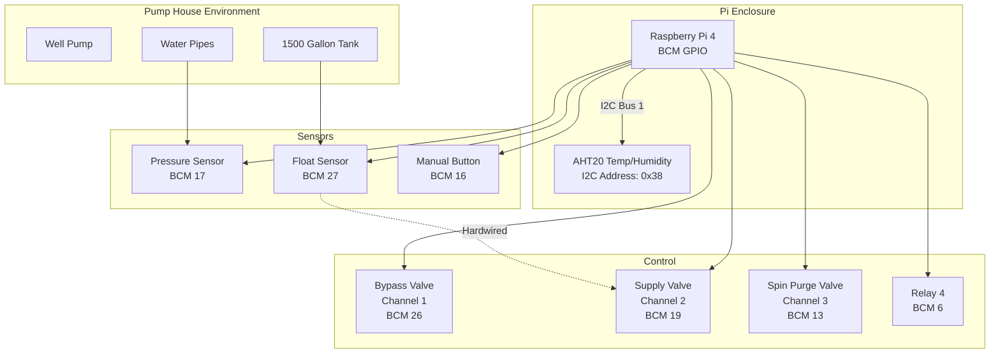
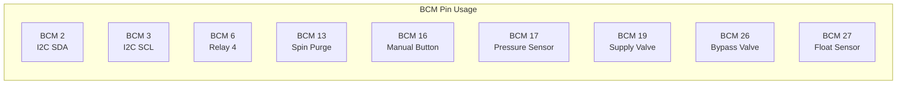
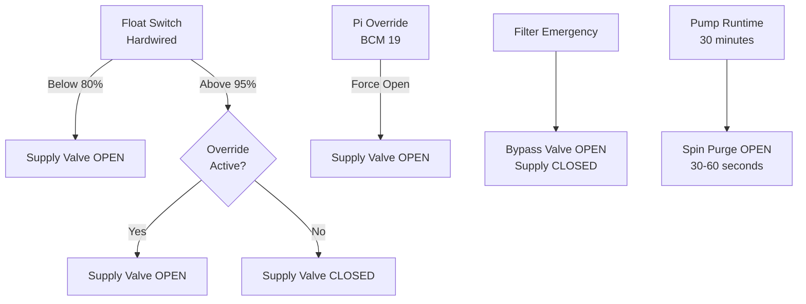
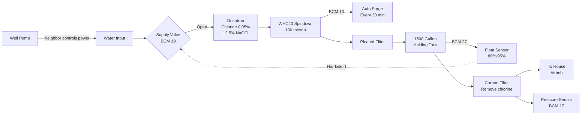
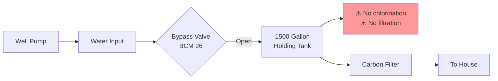
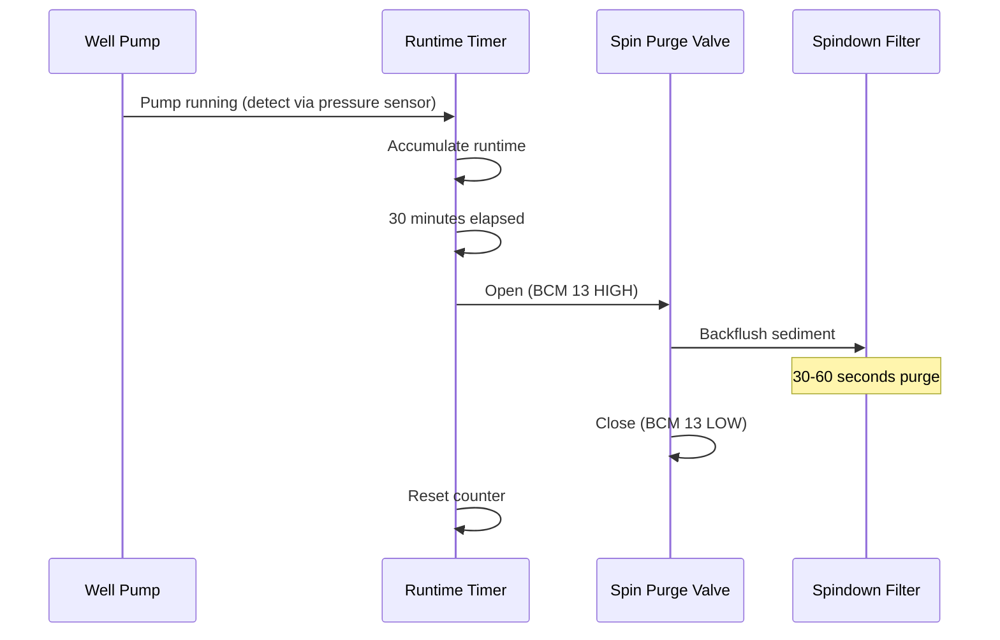
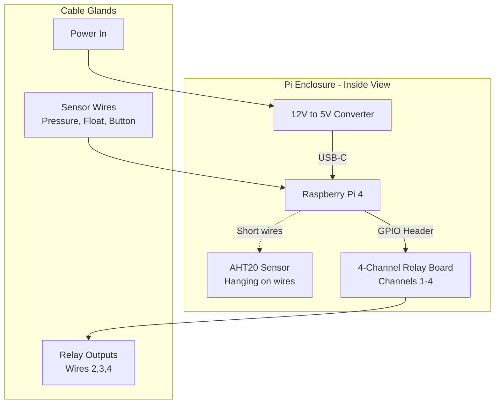
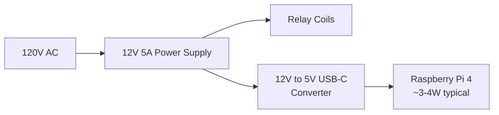
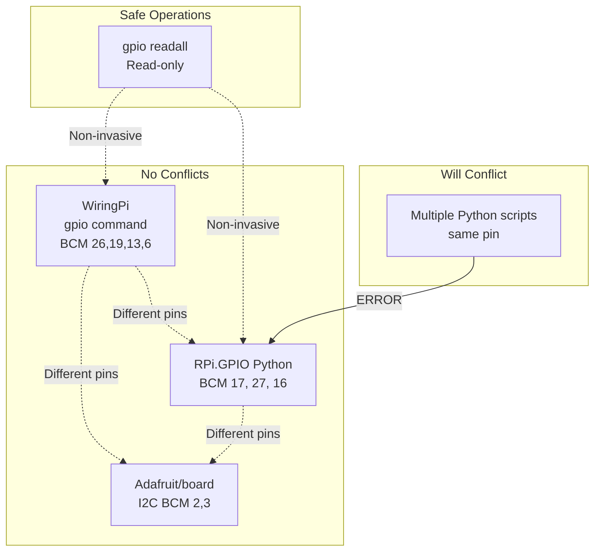
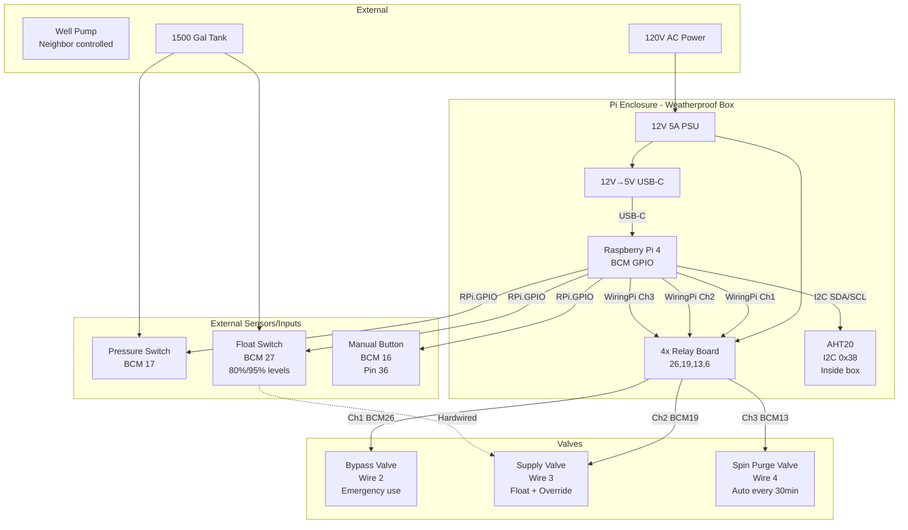

# Pump House Monitoring System

Raspberry Pi 4 based monitoring and control system for remote well water pump house.

## System Overview


## GPIO Pin Assignments


### Pin Table

| BCM Pin | Physical Pin | Function | Type | Library |
|---------|--------------|----------|------|---------|
| 2 | 3 | I2C SDA | I2C Data | Python (board) |
| 3 | 5 | I2C SCL | I2C Clock | Python (board) |
| 6 | 31 | Relay 4 (Reserved) | Output | WiringPi (gpio) |
| 13 | 33 | Spin Purge Valve (Channel 3) | Output | WiringPi (gpio) |
| 16 | 36 | Manual Button | Input | Python (RPi.GPIO) |
| 17 | 11 | Pressure Sensor | Input | Python (RPi.GPIO) |
| 19 | 35 | Supply Valve (Channel 2) | Output | WiringPi (gpio) |
| 26 | 37 | Bypass Valve (Channel 1) | Output | WiringPi (gpio) |
| 27 | 13 | Float Sensor | Input | Python (RPi.GPIO) |

### Reserved/Unavailable Pins

| BCM Pin(s) | Function | Reason to Avoid |
|------------|----------|-----------------|
| 0, 1 | ID EEPROM | HAT identification |
| 4 | GPCLK0 | Clock signal |
| 7, 8, 9, 10, 11 | SPI | SPI interface |
| 14, 15 | UART/Serial | Console/debugging |

## Valve Configuration & Functions

### Relay Channel Assignments

| Channel | BCM Pin | Physical Pin | Valve Name | Power Wire | Function |
|---------|---------|--------------|------------|------------|----------|
| 1 | 26 | 37 | Bypass Valve | Wire 2 | Emergency bypass - water flows to tank without filtration/dosing |
| 2 | 19 | 35 | Supply Valve | Wire 3 | Primary inlet - allows water to flow into tank (with float override) |
| 3 | 13 | 33 | Spin Purge Valve | Wire 4 | Automated spindown filter purging to remove sediment |
| 4 | 6 | 31 | Reserved | - | Available for future use |

### Valve Functions - Detailed

#### Supply Valve (Channel 2 - BCM 19 - Wire 3)

**Primary Function:** Controls water flow from well into the 1500-gallon holding tank

**Hardware Configuration:**
- Float switch is **hardwired** directly to the supply valve
- Float switch operates independently of Pi control
- Pi relay provides **override** capability only

**Float Switch Behavior (Hardwired):**
- **Turns ON:** Tank level drops below ~80% (±5%)
- **Turns OFF:** Tank level reaches ~95% (±5%)
- **Hysteresis:** ~15% range prevents rapid cycling
- **Always active:** Cannot be disabled by Pi

**Pi Override Function:**
- Pi relay (BCM 19) can **force valve open** above 80% level
- **Use case:** Manual fill operation when neighbor's electricity is available
- Override does **not** disable float switch protection
- When override active, valve remains open until:
  - Override turned off AND
  - Float switch indicates >95% level

**Normal Water Path (Supply Valve Open):**
```
Well → Dosatron (chlorine injection) → Tank
```

#### Bypass Valve (Channel 1 - BCM 26 - Wire 2)

**Primary Function:** Emergency water delivery bypassing filtration and chemical injection systems

**Use Cases:**
- **Filter clogged:** When spindown or pleated filters are blocked and maintenance cannot immediately service
- **Dosatron failure:** If chemical injection system fails
- **Emergency water needs:** Airbnb guests need water but filtration system has issues
- **Temporary operation:** While waiting for filter replacement or repair

**Bypass Water Path (Bypass Valve Open):**
```
Well → DIRECTLY to Tank (bypassing Dosatron and filters)
```

**Important Notes:**
- Water quality may be degraded (no chlorination)
- Sediment will enter tank (no filtration)
- Should only be used temporarily
- **Never run both supply and bypass simultaneously** - this could create flow/pressure issues

**Safety Considerations:**
- Guests should be notified if bypass is in use
- Consider chlorine shock treatment after bypass use
- Monitor tank sediment levels after bypass operation

#### Spin Purge Valve (Channel 3 - BCM 13 - Wire 4)

**Primary Function:** Automatically purge sediment from WHC40 spindown filter

**Operation:**
- Opens valve to backflush collected sediment from spindown filter
- Prevents filter clogging that would otherwise require weekly service
- Extends filter service interval from weekly to 6-8 months

**Algorithm Requirements:**
- Track pump runtime (well pump operation)
- Trigger purge every 30 minutes of cumulative pump runtime
- Purge duration: 30-60 seconds typical
- Monitor pressure sensor to detect if purge is effective

**Purge Sequence:**
1. Detect pump has been running (pressure sensor active)
2. Accumulate runtime
3. At 30-minute threshold, open spin purge valve (BCM 13 HIGH)
4. Hold open for 30-60 seconds
5. Close valve (BCM 13 LOW)
6. Reset runtime counter
7. Monitor pressure to verify filter flow improved

**Maintenance Impact:**
- **Before automation:** Weekly filter service ($55/visit = ~$2,860/year)
- **After automation:** 6-8 month service intervals (~$330-440/year)
- **Annual savings:** ~$2,400-2,500

**Failure Modes:**
- If purge ineffective: Extended pump runtime (>2 hours) indicates clogged filter
- If valve fails open: Continuous sediment discharge (monitor water clarity)
- If valve fails closed: No purging occurs (return to weekly service schedule)

### Valve Operation Matrix

| Scenario | Supply Valve | Bypass Valve | Spin Purge | Result |
|----------|--------------|--------------|------------|--------|
| Normal Operation | AUTO (Float) | CLOSED | AUTO (30min) | Standard filtered/chlorinated water |
| Manual Fill | OVERRIDE ON | CLOSED | AUTO (30min) | Force fill above 80% when power available |
| Filter Emergency | CLOSED | OPEN | N/A | Unfiltered water to tank (temporary) |
| Filter Maintenance | CLOSED | CLOSED | CLOSED | No water flow during service |
| Purge Cycle | OPEN | CLOSED | OPEN (60sec) | Flush sediment while filling |

**Critical Safety Rule:** 
- ⚠️ **NEVER open both Supply and Bypass valves simultaneously**
- Could cause backflow, pressure issues, or contamination


## Water System Flow

### Normal Operation Flow


### Emergency Bypass Flow


### Spindown Purge Operation


## Hardware Setup

### Enclosure Layout


### Power System


**Why separate power supplies:**
- Relay switching doesn't affect Pi power
- Easier troubleshooting
- Pi gets clean 5V power

## Software Architecture

### Library Usage by Component

| Component | Library | Why This Choice |
|-----------|---------|-----------------|
| Relays (All) | WiringPi (`gpio` command) | Simple, command-line testable |
| Pressure Sensor | RPi.GPIO | Direct GPIO input reading |
| Float Sensor | RPi.GPIO | Direct GPIO input reading |
| Manual Button | RPi.GPIO | Direct GPIO input reading |
| Temp/Humidity | adafruit-circuitpython-ahtx0 | I2C protocol handling |
| CPU Temperature | `/sys/class/thermal/thermal_zone0/temp` | Built-in kernel interface |

### GPIO Library Interactions


**Key Points:**
- **WiringPi and Python can coexist** if using different pins
- **Python locks pins exclusively** - can't run two scripts on same pin
- **`gpio readall` is safe** - read-only, doesn't claim pins
- **`GPIO.cleanup()`** releases pins when script exits

## Installation & Setup

### Enable I2C
```bash
sudo raspi-config
# Interface Options -> I2C -> Enable
sudo reboot
```

### Install Required Software
```bash
# System packages
sudo apt update
sudo apt install -y python3-pip i2c-tools wiringpi

# Python libraries
sudo pip3 install RPi.GPIO adafruit-circuitpython-ahtx0 --break-system-packages
```

### Verify I2C Sensor
```bash
# Should show device at 0x38
sudo i2cdetect -y 1
```

### Test Temperature Sensor
```python
#!/usr/bin/env python3
import board
import adafruit_ahtx0

i2c = board.I2C()
sensor = adafruit_ahtx0.AHTx0(i2c)

temp_f = (sensor.temperature * 9/5) + 32
print(f"Temp: {temp_f:.1f}°F  Humidity: {sensor.relative_humidity:.1f}%")
```

### Test Relay Control
```bash
# WiringPi commands
gpio -g mode 26 out    # Set BCM 26 as output (Bypass)
gpio -g write 26 1     # Turn relay ON
gpio -g write 26 0     # Turn relay OFF

# Supply valve override
gpio -g mode 19 out
gpio -g write 19 1     # Force valve open (override)
gpio -g write 19 0     # Release override (float control)

# Spindown purge
gpio -g mode 13 out
gpio -g write 13 1     # Start purge
sleep 30               # Purge for 30 seconds
gpio -g write 13 0     # Stop purge

gpio readall           # Show all pin states
```

### Test Button Input
```python
#!/usr/bin/env python3
import RPi.GPIO as GPIO
import time

BUTTON_PIN = 16

GPIO.setmode(GPIO.BCM)
GPIO.setup(BUTTON_PIN, GPIO.IN, pull_up_down=GPIO.PUD_UP)

print("Button test - Press Ctrl+C to exit")
print("Button connected to BCM 16 (Physical Pin 36)")

try:
    while True:
        button_state = GPIO.input(BUTTON_PIN)
        if button_state == GPIO.LOW:
            print("Button PRESSED")
        else:
            print("Button RELEASED")
        time.sleep(0.5)
except KeyboardInterrupt:
    print("\nExiting...")
finally:
    GPIO.cleanup()
```

## Environmental Monitoring

### Temperature & Humidity Sensor (AHT20)

**Location:** Inside Pi enclosure  
**Purpose:** Monitor enclosure health, detect condensation risk

#### Normal Operating Ranges

| Condition | Range | Action |
|-----------|-------|--------|
| Temperature | 40-85°F | Normal operation |
| Temperature | <40°F | Check heating, freeze risk |
| Temperature | >85°F | Check cooling, Pi throttling risk |
| Humidity | 30-75% | Normal operation |
| Humidity | >85% | Condensation risk - add desiccant |
| Humidity | >90% | High risk - check seals |

#### Dew Point Calculation
```python
import math

def calculate_dew_point(temp_c, humidity):
    """
    Magnus formula approximation
    Returns dew point in Celsius
    """
    a = 17.27
    b = 237.7
    alpha = ((a * temp_c) / (b + temp_c)) + math.log(humidity/100.0)
    dew_point = (b * alpha) / (a - alpha)
    return dew_point
```

**Condensation occurs when any surface drops below dew point temperature.**

### CPU Temperature Monitoring
```python
def get_cpu_temp():
    with open('/sys/class/thermal/thermal_zone0/temp', 'r') as f:
        return float(f.read()) / 1000.0
```

**Thermal Limits:**
- **Normal idle:** 40-50°C
- **Under load:** 50-70°C
- **Throttling starts:** 80°C (CPU slows down)
- **Critical shutdown:** 85°C

**CPU temp ≠ Ambient temp** - CPU runs 10-20°C hotter than enclosure air.

## Maintenance Considerations

### Future Improvements

- [x] Document manual button pin assignment (BCM 16)
- [ ] Add barrel connectors for easy Pi box removal
- [ ] Service loops (12-18" slack) in all wiring
- [ ] Silica gel desiccant packs if humidity stays >85%
- [ ] Label all connections with heat shrink
- [ ] Consider conformal coating on boards for moisture protection

### Condensation Mitigation

If humidity remains high (>85% for extended periods):

1. **Passive desiccant** - Rechargeable silica gel packs
2. **Ventilation** - Breathable membrane vent (top) + sealed gland (bottom)
3. **Active heating** - Small heating element (Pi self-heating may be sufficient)

### Cable Gland Best Practices

- Proper IP rating for outdoor environment
- Don't over-tighten (can damage cable insulation)
- Leave stress relief loops inside box
- Use appropriately sized glands for wire bundle

### Spindown Filter Maintenance

**Before Automation:**
- Service interval: Weekly (~$55/visit = $2,860/year)
- Filter changes required due to sediment buildup
- Labor-intensive for maintenance personnel

**After Automation (Channel 3 - BCM 13):**
- Automatic purge every 30 minutes of pump runtime
- Expected service interval: 6-8 months
- Estimated annual savings: ~$2,400

## Troubleshooting

### I2C Sensor Not Detected
```bash
# Check if I2C is enabled
ls /dev/i2c*

# Scan for devices
sudo i2cdetect -y 1

# Check wiring
# VCC -> 3.3V (pin 1 or 17)
# GND -> Ground
# SDA -> BCM 2 (pin 3)
# SCL -> BCM 3 (pin 5)
```

### Python GPIO Conflicts

**Error:** `RuntimeWarning: This channel is already in use`

**Solutions:**
```python
# Option 1: Suppress warnings (not recommended)
GPIO.setwarnings(False)

# Option 2: Clean up before use
GPIO.cleanup()

# Option 3: Always clean up when done
try:
    # Your code
finally:
    GPIO.cleanup()

# Option 4: Consolidate into single script
```

### Relay Not Switching
```bash
# Check if pin is set as output
gpio readall

# Test manually
gpio -g mode 26 out
gpio -g write 26 1

# Check physical connections
# - Power to relay board
# - GPIO connection
# - Relay board jumpers (if applicable)
```

### Supply Valve Won't Close

**Symptom:** Supply valve stays open even when tank is full

**Troubleshooting:**
1. Check float switch operation (hardwired - independent of Pi)
2. Verify tank level actually above 95%
3. Check if Pi override (BCM 19) is stuck ON
4. Test float switch continuity with multimeter
5. Verify float switch mounting/adjustment at 80%/95% levels
```bash
# Check override relay state
gpio readall | grep "19"

# Turn off override
gpio -g write 19 0
```

### Extended Pump Runtime (>2 Hours)

**Symptom:** Well pump runs for extended periods without filling tank

**Most Common Cause:** Clogged spindown filter restricting flow

**Troubleshooting:**
1. Check if automatic purge is functioning (BCM 13)
2. Manually trigger purge cycle
3. Inspect spindown filter bowl for sediment buildup
4. Consider temporary bypass while arranging filter service
5. Review purge algorithm timing (may need more frequent purges)
```bash
# Manual purge test
gpio -g mode 13 out
gpio -g write 13 1
sleep 60  # Purge for 60 seconds
gpio -g write 13 0

# Check if pump runtime improves after manual purge
```

### Button Not Responding

**Symptom:** Button press not detected by Python script

**Troubleshooting:**
```python
# Test button with simple script
import RPi.GPIO as GPIO

GPIO.setmode(GPIO.BCM)
GPIO.setup(16, GPIO.IN, pull_up_down=GPIO.PUD_UP)

print(f"Button state: {GPIO.input(16)}")
# Should print 1 (HIGH) when not pressed, 0 (LOW) when pressed

GPIO.cleanup()
```

**Common Issues:**
- Wrong pull-up/pull-down configuration
- Button wiring reversed (NO vs NC)
- Loose connection in cable gland
- Button pin not properly initialized before reading

## System Diagram - Complete


## Code Examples

### Read Temperature Sensor (Command Line Tool)

Save as `~/bin/read_temp.py`:
```python
#!/usr/bin/env python3
"""Simple command-line temperature reader for AHT20 sensor"""
import sys
import board
import adafruit_ahtx0

try:
    i2c = board.I2C()
    sensor = adafruit_ahtx0.AHTx0(i2c)
    temp_f = (sensor.temperature * 9/5) + 32
    humidity = sensor.relative_humidity
    
    # Output format: "temp_f humidity"
    print(f"{temp_f:.1f} {humidity:.1f}")
except Exception as e:
    print(f"Error reading sensor: {e}", file=sys.stderr)
    sys.exit(1)
```

Make executable:
```bash
chmod +x ~/bin/read_temp.py
```

### Complete Monitoring Script
```python
#!/usr/bin/env python3
"""
Pump house monitoring system
Reads all sensors and logs to file
"""
import time
import board
import adafruit_ahtx0
import RPi.GPIO as GPIO
from datetime import datetime

# GPIO Pin Configuration (BCM numbering)
PRESSURE_SENSOR_PIN = 17
FLOAT_SENSOR_PIN = 27
BUTTON_PIN = 16

# Initialize GPIO
GPIO.setmode(GPIO.BCM)
GPIO.setup(PRESSURE_SENSOR_PIN, GPIO.IN, pull_up_down=GPIO.PUD_UP)
GPIO.setup(FLOAT_SENSOR_PIN, GPIO.IN, pull_up_down=GPIO.PUD_UP)
GPIO.setup(BUTTON_PIN, GPIO.IN, pull_up_down=GPIO.PUD_UP)

# Initialize I2C sensor
i2c = board.I2C()
temp_sensor = adafruit_ahtx0.AHTx0(i2c)

def get_cpu_temp():
    """Read CPU temperature"""
    with open('/sys/class/thermal/thermal_zone0/temp', 'r') as f:
        return float(f.read()) / 1000.0

def celsius_to_fahrenheit(celsius):
    """Convert Celsius to Fahrenheit"""
    return (celsius * 9/5) + 32

def read_all_sensors():
    """Read all system sensors"""
    # Temperature/Humidity
    temp_c = temp_sensor.temperature
    temp_f = celsius_to_fahrenheit(temp_c)
    humidity = temp_sensor.relative_humidity
    
    # CPU Temperature
    cpu_temp_c = get_cpu_temp()
    cpu_temp_f = celsius_to_fahrenheit(cpu_temp_c)
    
    # Digital sensors (active LOW - pressed/active = 0)
    pressure = GPIO.input(PRESSURE_SENSOR_PIN)
    float_switch = GPIO.input(FLOAT_SENSOR_PIN)
    button = GPIO.input(BUTTON_PIN)
    
    return {
        'timestamp': datetime.now().isoformat(),
        'temp_f': temp_f,
        'humidity': humidity,
        'cpu_temp_f': cpu_temp_f,
        'pressure': pressure,
        'float': float_switch,
        'button': button
    }

def main():
    """Main monitoring loop"""
    print("Pump House Monitor Starting...")
    print("Press Ctrl+C to exit")
    
    try:
        while True:
            data = read_all_sensors()
            
            # Console output
            output = (f"{data['timestamp']} | "
                     f"Temp: {data['temp_f']:.1f}°F | "
                     f"Humidity: {data['humidity']:.1f}% | "
                     f"CPU: {data['cpu_temp_f']:.1f}°F | "
                     f"Pressure: {'OK' if data['pressure'] else 'LOW'} | "
                     f"Float: {'HIGH (>80%)' if data['float'] else 'LOW (<80%)'} | "
                     f"Button: {'PRESSED' if not data['button'] else 'RELEASED'}")
            
            print(output)
            
            # Log to file (optional)
            # with open('/var/log/pump_monitor.log', 'a') as f:
            #     f.write(f"{data}\n")
            
            time.sleep(5)
            
    except KeyboardInterrupt:
        print("\nShutting down...")
    finally:
        GPIO.cleanup()

if __name__ == "__main__":
    main()
```

### Spindown Purge Algorithm (Conceptual)
```python
#!/usr/bin/env python3
"""
Spindown filter auto-purge based on pump runtime
"""
import time
import subprocess
import RPi.GPIO as GPIO

# Configuration
PRESSURE_SENSOR_PIN = 17
SPIN_PURGE_RELAY = 13  # Controlled via WiringPi
PURGE_INTERVAL_SECONDS = 30 * 60  # 30 minutes
PURGE_DURATION_SECONDS = 60  # 60 seconds

# Initialize GPIO for sensor reading
GPIO.setmode(GPIO.BCM)
GPIO.setup(PRESSURE_SENSOR_PIN, GPIO.IN, pull_up_down=GPIO.PUD_UP)

def is_pump_running():
    """Check if well pump is running via pressure sensor"""
    return GPIO.input(PRESSURE_SENSOR_PIN) == GPIO.LOW

def open_purge_valve():
    """Open spin purge valve using WiringPi"""
    subprocess.run(['gpio', '-g', 'write', str(SPIN_PURGE_RELAY), '1'])
    print(f"Purge valve OPENED")

def close_purge_valve():
    """Close spin purge valve using WiringPi"""
    subprocess.run(['gpio', '-g', 'write', str(SPIN_PURGE_RELAY), '0'])
    print(f"Purge valve CLOSED")

def main():
    """Main purge control loop"""
    print("Spindown Purge Controller Starting...")
    print(f"Will purge every {PURGE_INTERVAL_SECONDS/60} minutes of pump runtime")
    
    # Initialize relay
    subprocess.run(['gpio', '-g', 'mode', str(SPIN_PURGE_RELAY), 'out'])
    close_purge_valve()
    
    cumulative_runtime = 0
    last_pump_state = False
    
    try:
        while True:
            pump_running = is_pump_running()
            
            # Accumulate runtime when pump is running
            if pump_running:
                cumulative_runtime += 1  # 1 second increment
                if not last_pump_state:
                    print(f"Pump started running")
                    
                # Check if purge is needed
                if cumulative_runtime >= PURGE_INTERVAL_SECONDS:
                    print(f"Purge threshold reached ({cumulative_runtime}s)")
                    print(f"Starting {PURGE_DURATION_SECONDS}s purge cycle...")
                    
                    open_purge_valve()
                    time.sleep(PURGE_DURATION_SECONDS)
                    close_purge_valve()
                    
                    print(f"Purge complete. Resetting runtime counter.")
                    cumulative_runtime = 0
                    
            else:
                if last_pump_state:
                    print(f"Pump stopped. Total runtime: {cumulative_runtime}s")
            
            last_pump_state = pump_running
            time.sleep(1)  # Check every second
            
    except KeyboardInterrupt:
        print("\nShutting down...")
        close_purge_valve()
    finally:
        GPIO.cleanup()

if __name__ == "__main__":
    main()
```

### Relay Control Examples
```bash
#!/bin/bash
# Relay control examples using WiringPi

# Bypass Valve (Channel 1, BCM 26, Wire 2)
# Use for filter emergency - bypasses Dosatron and filters
gpio -g mode 26 out
gpio -g write 26 1  # Open bypass (water flows unfiltered to tank)
gpio -g write 26 0  # Close bypass

# Supply Valve Override (Channel 2, BCM 19, Wire 3)
# Note: Float switch is hardwired - this only provides override
gpio -g mode 19 out
gpio -g write 19 1  # Force valve open (override float - fill above 80%)
gpio -g write 19 0  # Release override (float control resumes)

# Spindown Purge (Channel 3, BCM 13, Wire 4)
# Auto-flush sediment from spindown filter
gpio -g mode 13 out
gpio -g write 13 1  # Start purge
sleep 30            # Purge for 30 seconds
gpio -g write 13 0  # Stop purge

# Check all relay states
gpio readall
```

## Quick Reference Commands
```bash
# Check I2C devices
sudo i2cdetect -y 1

# Read all GPIO states
gpio readall

# Control valves
gpio -g write 26 1  # Bypass ON (emergency - unfiltered water)
gpio -g write 19 1  # Supply override ON (force fill above 80%)
gpio -g write 13 1  # Spin purge ON (flush sediment)
gpio -g write 6 1   # Relay 4 ON (reserved)

# Read temperature sensor
python3 ~/bin/read_temp.py

# Monitor CPU temperature
vcgencmd measure_temp

# Check system temperature
cat /sys/class/thermal/thermal_zone0/temp

# Run complete monitor
python3 pump_monitor.py

# Run spindown purge controller
python3 spindown_purge.py
```

## Wiring Reference

### I2C Temperature Sensor (AHT20)
```
AHT20        Raspberry Pi
------       ------------
VCC    <-->  3.3V (Pin 1 or 17)
GND    <-->  Ground (Pin 6, 9, 14, 20, 25, 30, 34, or 39)
SDA    <-->  BCM 2 (Pin 3)
SCL    <-->  BCM 3 (Pin 5)
```

### Relay Board
```
Relay Board     Raspberry Pi     Function            Power Wire
-----------     ------------     --------            ----------
VCC       <-->  5V or 12V        Power for relays    
GND       <-->  Ground           
IN1       <-->  BCM 26 (Pin 37)  Bypass Valve        Wire 2
IN2       <-->  BCM 19 (Pin 35)  Supply Valve        Wire 3
IN3       <-->  BCM 13 (Pin 33)  Spin Purge Valve    Wire 4
IN4       <-->  BCM 6 (Pin 31)   Reserved/Unused     
```

### Pressure Sensor (Switch)
```
Pressure Switch    Raspberry Pi
---------------    ------------
COM/NO       <-->  BCM 17 (Pin 11)
GND          <-->  Ground

Function: Detects when water is flowing (pump running)
```

### Float Sensor (Switch)
```
Float Switch       Raspberry Pi
------------       ------------
COM/NO       <-->  BCM 27 (Pin 13)
GND          <-->  Ground

Float Switch       Supply Valve
------------       ------------
COM/NO       <-->  Hardwired connection (independent of Pi)

Function: 
- Pi connection: Monitor tank level (80%/95% thresholds)
- Hardwired: Direct control of supply valve with hysteresis
```

### Manual Button
```
Button             Raspberry Pi
------             ------------
NO/COM       <-->  BCM 16 (Pin 36)
GND          <-->  Ground

Function: Manual user input for control/override functions
Configuration: Active LOW (pressed = 0, released = 1) with pull-up resistor
```

## Coastal Environment Considerations

### Salt Air Corrosion

**Expected component lifespan: 2-5 years**

Protection strategies:
- Conformal coating on PCBs
- Silicone grease on terminals
- Regular inspection schedule
- Stainless steel or plastic hardware

### Moisture Management

**Key metrics from installation:**
- Initial (box opened in rain): 89.7% RH @ 54.2°F
- After 30 minutes: 86.3% RH @ 53.7°F
- After 1 hour: 80.9% RH @ 54.7°F
- Target range: 60-75% RH

**Dew point monitoring:**
- At 90% RH, 54°F → Dew point ~52°F (2°F margin)
- At 80% RH, 55°F → Dew point ~48°F (7°F margin)
- Safe operation requires >5°F margin

### Freeze Protection

Monitor for:
- Water temperature approaching 32°F
- Enclosure temperature <40°F
- Humidity spikes (ice formation/melting)

## Project Context

### Design Philosophy

**"Remember in 5 Years" Principle:**
- All components maintainable without specialized knowledge
- Clear documentation and labeling
- Standard connectors where possible
- Minimal custom fabrication

### Remote Operation Requirements

**Site Access:**
- 10 hours round trip from primary residence
- Infrequent site visits (monthly at best)
- Must operate reliably unsupervised
- Remote monitoring essential

**Stakeholders:**
- Primary user (Eric)
- Uphill neighbor (controls well pump electricity - affects water availability timing)
- Airbnb guests (depend on water availability)
- Maintenance personnel ($55/visit)

### Water System Constraints

**Well Pump Considerations:**
- Controlled by neighbor's electricity
- Only available when neighbor is running power
- Creates timing dependency for tank filling
- Supply override (BCM 19) allows opportunistic filling when power available

**Well Characteristics:**
- Produces 2-3 gallons every 15-20 minutes (not continuous high flow)
- Extended 2+ hour pump runs typically indicate clogged spindown filter
- Sediment issues require frequent filter maintenance (now automated)

### Success Criteria

- ✅ Reduce maintenance visit frequency (from weekly to 6-8 months)
- ✅ Enable remote monitoring
- ✅ Prevent freeze damage
- ✅ Ensure guest water availability
- ✅ System understandable by future maintainers
- ✅ Automated spindown filter purging
- ✅ Emergency bypass capability for filter failures

## References

- [Raspberry Pi GPIO Pinout](https://pinout.xyz/)
- [WiringPi GPIO Reference](http://wiringpi.com/pins/)
- [AHT20 Datasheet](http://www.aosong.com/en/products-40.html)
- [Adafruit CircuitPython](https://learn.adafruit.com/welcome-to-circuitpython)
- [RPi.GPIO Documentation](https://sourceforge.net/p/raspberry-gpio-python/wiki/Home/)
- [WHC40 Spindown Filter Documentation](https://www.whirlpool.com/)

## Project History

- **Initial Setup:** 4-channel relay board with WiringPi control
  - Channel 1 (BCM 26): Bypass valve - emergency unfiltered water delivery
  - Channel 2 (BCM 19): Supply valve with float override - normal water inlet
  - Channel 3 (BCM 13): Spindown purge - automated sediment flushing (every 30 min)
  - Channel 4 (BCM 6): Reserved/unused
- **Sensor Addition:** 
  - Pressure sensor (BCM 17) - detect pump operation
  - Float sensor (BCM 27) - monitor tank level (80%/95%)
  - Manual button (BCM 16) - user input
- **Float Switch Integration:** Hardwired float switch provides independent 80%/95% hysteresis control
- **Environmental Monitoring:** AHT20 I2C sensor (0x38) installed inside Pi enclosure
- **Documentation:** GPIO pin conflicts resolved, library interactions documented, valve functions clarified
- **Humidity Event:** Initial 89.7% RH after opening box in rain, naturally decreased to ~81% within 1 hour
- **Filter Upgrade:** Upgraded from 200-micron to 100-micron spindown filtration

## Future Enhancements

### Planned
- [ ] Implement complete spindown purge algorithm with pump runtime tracking
- [ ] Button function assignment (what should BCM 16 button do?)
- [ ] Consolidated Python monitoring script with all sensors
- [ ] Data logging to CSV/database
- [ ] Email/SMS alerts for critical conditions (high humidity, extended pump runtime, etc.)
- [ ] Web dashboard for remote monitoring
- [ ] Automatic valve control based on sensor readings

### Considered
- [ ] Second I2C sensor for pump house ambient temperature (outside Pi box)
- [ ] 1-Wire temperature sensors on pipes for freeze detection
- [ ] Current monitoring on pump circuit
- [ ] Solar panel + battery backup
- [ ] Cellular backup for network connectivity
- [ ] Expand pump house to accommodate larger filtration systems (summer project)
- [ ] Wyze Cam v4 for audio detection (Dosatron click counting for flow rate calculation)
- [ ] Peristaltic or diaphragm metering pump for more precise chlorine control
- [ ] Relocate second pressure sensor from dead-end to main flow path
- [ ] Remote tank fill override UI (web/app based)
- [ ] Automatic bypass activation on extended pump runtime (filter emergency)

## Equipment Specifications

### Dosatron Chemical Injection
- **Model:** D14WL3000NAFII (NSF Certified)
- **Injection Range:** 0.03% to 0.3% (1:3000 to 1:333)
- **Flow Range:** 0.05 to 14 GPM
- **Chemical:** 12.5% sodium hypochlorite
- **Setting:** 0.05% (approximately 6 ppm injection)
- **Location:** Between well and holding tank (before supply valve)
- **Purpose:** Prevent bacterial growth, maintain water quality
- **Note:** Bypassed when emergency bypass valve (BCM 26) is active

### Filtration System
- **Primary Filter:** WHC40 spindown filter
  - Upgraded from 200-micron to 100-micron
  - Auto-purge every 30 minutes of pump runtime (BCM 13)
  - Purpose: Remove sediment, extend service intervals
- **Secondary Filter:** Pleated filtration stages
- **Tertiary Filter:** Carbon filter (removes chlorine before household use)

### Storage Tank
- **Capacity:** 1500 gallons
- **Fill Control:** Float switch (hardwired) with 80%/95% hysteresis
- **Fill Rate:** 2-3 gallons every 15-20 minutes (well production rate)
- **Override:** Pi relay (BCM 19) for manual fill above 80%
- **Bypass Option:** Emergency bypass valve (BCM 26) for unfiltered filling

### Valves

| Valve | Model/Specs | Control | Purpose |
|-------|-------------|---------|---------|
| Supply Valve | Solenoid, 120V | BCM 19 (override) + Float (hardwired) | Normal water inlet with chlorination/filtration |
| Bypass Valve | Solenoid, 120V | BCM 26 | Emergency unfiltered water delivery |
| Spin Purge Valve | Solenoid, 120V | BCM 13 | Automated spindown filter backflush |

---

**Last Updated:** November 2024  
**Hardware:** Raspberry Pi 4  
**OS:** Raspberry Pi OS Trixie (Debian 13)  
**Python:** 3.13  
**Location:** Coastal Oregon Pump House  
**Primary Contact:** Eric
